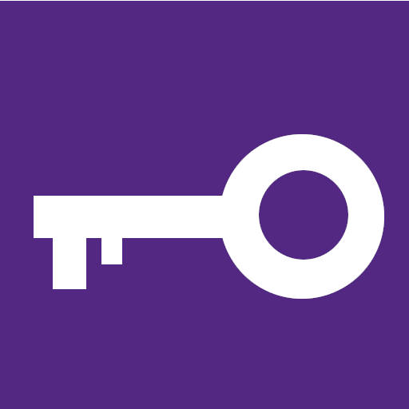

<div align="center">



# Keeweb

A self-hosted [Keeweb](https://github.com/keeweb/keeweb) implementation.


</div>


### Description 
Uses the Keeweb frontend package and a WebDAV server to store the database.


### Prerequisites
To build the application, you need to have the following packages installed:
- Docker
- Docker-compose


### Installation

1. Clone this repository
1. Create a directory `webdav`  at the root of the repository and add your `database.kdbx` file to it.
1. Give it the correct permissions (`chmod -R 777 webdav`)
1. Create an user to access the files inside the WebDAV folder :
   ```bash
   echo ${USERNAME} > ./config/user.psswd
   openssl passwd -apr1 | tee -a ./config/user.psswd
   ```
   ⚠️ This step is mandatory. By default you will access the WebDAV server with the user `user` and password : `password`.
1. You can customize the configuration of Keeweb by editing the `config.json` file. Check the [documentation](https://github.com/keeweb/keeweb/wiki/Configuration#json-app-config) for more information.
1. Your applicatiion is ready 🚀 Launch it with the following command:
   ```bash
   docker run -d -p 80:80 -p 443:443 -v "$PWD":/var/www/html gridexx/keeweb
   ```
1. Open your browser and go to http://localhost, you should see the Keeweb frontend page 😃.


---

### Sources
- https://www.digitalocean.com/community/tutorials/how-to-configure-webdav-access-with-apache-on-ubuntu-20-04  
- https://github.com/keeweb/keeweb  
- https://www.zaine.me/posts/keeweb-passwd-manager/

*&copy; Created by GridexX with 🐳 Docker and 🤟 passion*